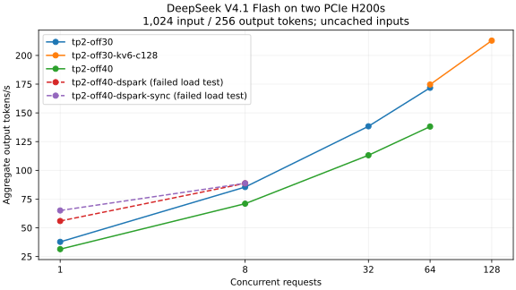

# DeepSeek V4.1 Flash on two PCIe H200s

**Native-weight serving at a 1,048,576-token context limit works on two H200s.**
The strongest stable configuration in this development spike delivered about
43 decode tokens/s for one request and 213 aggregate output tokens/s at 128
concurrent short requests. Two distinct near-full contexts also completed
generation with overlapping decode intervals and correct retrieval.

Measured on 2026-10-04. These are development measurements outside the release
gate. No vLLM source patch or additional weight quantization was used.

Use [tp2-off30-kv6-c128.yaml](tp2-off30-kv6-c128.yaml) with
[runtime-environment.yaml](runtime-environment.yaml). It uses TP2 plus expert
parallelism, Engram host offload, a nominal 30 GiB of additional expert offload
per GPU, 6 GiB KV per GPU, and a 128-sequence scheduler limit. DSpark is disabled.
The loader actually offloaded 30.59 GiB of experts per rank because it moves
whole parameters. Together with approximately 188.8 GiB of Engram tables and
scales, this places approximately 250 GiB of weights in host RAM. The GPUs still
perform inference and read offloaded expert weights over PCIe.

| Configuration | Natural single-stream decode | Aggregate C1 / C8 / C32 / C64 | Aggregate C128 | Sampled peak GPU memory |
| --- | ---: | --- | ---: | ---: |
| [TP2, offload 40, KV 8](tp2-off40.yaml) | 36.5 tok/s | 31.5 / 71.0 / 113.1 / 138.1 tok/s | — | 128.4 GiB/GPU |
| [TP2, offload 30, KV 8](tp2-off30.yaml) | 43.0 tok/s | 37.8 / 85.5 / 138.3 / 171.8 tok/s | — | 137.8 GiB/GPU |
| [TP2, offload 30, KV 6, limit 128](tp2-off30-kv6-c128.yaml) | 43.1 tok/s | — / — / — / 174.7 tok/s | **212.9 tok/s** | **135.7 GiB/GPU** |

Aggregate tests use 1,024 input tokens and 256 generated tokens per request.
The final C128 point completed all 256 requests and 65,536 output tokens in
307.85 seconds. A second random seed produced **213.0 tok/s**, again with all
requests and tokens completed. Both runs had zero prefix-cache hits and zero
preemptions. At C128, median time per output token was about 0.56 seconds per
request: aggregate throughput increases while individual streams slow down.



The final profile's startup estimate was 3,172,270 KV tokens, or 3.03 full
windows. Two full contexts were tested. The 128-request throughput test used
shorter inputs; scheduler capacity and full-window residency are separate limits.

| Full-context test | Input / output tokens | Time to first token | Decode rate | Outcome |
| --- | --- | ---: | ---: | --- |
| Offload 40, KV 8, cold | 1,047,987 / 512 | 506.47 s | 36.1 tok/s | Correct retrieval; completed |
| Offload 30, KV 8, cold | 1,047,987 / 512 | 428.44 s | 43.0 tok/s | Correct retrieval; completed |
| Offload 30, KV 8, repeated prefix | 1,047,987 / 512 | **4.10 s** | 42.2 tok/s | 1,047,936 cached input tokens; completed |
| Final profile, cold | 1,047,987 / 512 | **429.92 s** | **42.7 tok/s** | Correct retrieval; completed |
| Final profile, concurrent context A | 1,047,987 / 512 | 4.99 s | 30.1 tok/s | Correct distinct code; completed |
| Final profile, concurrent context B | 1,047,988 / 512 | 8.08 s | 30.7 tok/s | Correct distinct code; completed |

The paired contexts had different prefixes, retrieval codes, and cache salts.
Each was prepared separately before the timed concurrent test. Their decode
intervals overlapped for **13.88 seconds**. Together they delivered 1,024 output
tokens in 24.77 seconds, or **41.3 tok/s including TTFT and drain**. Server
counters confirmed 2,095,975 prompt tokens, 2,095,872 cache-hit tokens, and zero
preemptions. Preparing the second uncached context took 430.72 seconds; that
cost is excluded from the explicitly cached concurrent measurement.

The large prompts contain repeated inventory text with a code planted in the
middle. They establish token capacity and retrieval for this probe. Their cold
TTFT is not a prediction for every real document or codebase. Natural text,
arithmetic, and retrieval checks are limited correctness checks, not a model
quality evaluation. Images and tool calling were not exercised in this spike.

Three configurations were excluded from recommendations:

| Configuration | Successful preliminary checks | Failure |
| --- | --- | --- |
| [Adaptive DSpark](tp2-off40-dspark.yaml) | Natural text, full 1M request, C1 and C8 bursts | CUDA illegal memory access during C32 measurement; 56 requests reported completed, but only 10,657 of 16,384 output tokens delivered |
| [Adaptive DSpark, synchronous scheduling](tp2-off40-dspark-sync.yaml) | Natural text, full 1M request, C1 and C8 bursts | CUDA illegal memory access during C32 warmup; only 742 of 4,096 output tokens delivered |
| [PP2, offload 40](pp2-off40.yaml) | Weight loading | Startup failed: later pipeline stage lacked the input IDs required by vision-aware MoE routing |

The CUDA failures were reported at output-copy synchronization; the originating
kernel was not isolated. Disabling asynchronous scheduling did not eliminate
the failure. Failed and partial workloads contribute no throughput points to
the chart. The dashed DSpark curves show only earlier completed bursts and
are labelled as configurations that subsequently failed load testing.

The anonymous venue was `hopper-pcie-2`: two H200 NVL GPUs, 600 W each, PCIe 5
x16, with a cross-socket `SYS` link and no NVLink between them. CUDA reported
139.8 GiB per GPU. The host had two 16-core Xeon 6515P CPUs, 64 logical CPUs,
two NUMA domains, and a **967.2 GiB container memory limit**. Thus the experiment
used less host RAM than the 2 TB target. The final profile's observed host peak
was 869.7 GiB including checkpoint page cache and loading transients; this is
not a minimum-RAM measurement. Reserve both GPUs for the engine.

Initial diagnostics passed GPU allocation, BF16 matrix multiplication, and
two-rank NCCL all-reduce. Simultaneous pinned-host copies reached approximately
55.5 GB/s per GPU. A 64 MiB all-reduce reached about 22.5 GB/s algorithm
bandwidth. These diagnostics are distinct from the measured model throughput.

Software was vLLM 0.30.0, PyTorch 2.13.0+cu130, Transformers 5.17.0, Triton
3.7.1, FlashInfer 0.6.18.post1, NCCL 2.30.7, and driver 595.84. Exact pins:

```text
image: vllm/vllm-openai@sha256:8a69ffad015f138d7170c4ddc429e230a3bc1c1719f67e14324749df200a4b90
model: deepseek-ai/DeepSeek-V4.1-Flash
revision: dba1be0a40aa45a94ad051997016db3960a90277
```

Engine YAMLs are the exact bytes launched, checked against their receipt hashes.
The original [environment.yaml](environment.yaml) is retained as a declared
harness input. The harness overrode its compiler-cache paths;
[runtime-environment.yaml](runtime-environment.yaml) records the effective
model-process settings. Container GPU selection is separate and exposes exactly
two devices. No model or compilation cache was discarded between trials.

Inside the pinned image, with this directory available and the pinned model
already staged under `/workspace/hf`, start the tested profile with:

```bash
uv run --no-project python - <<'PY'
import os
from pathlib import Path
import yaml

root = Path('.')
os.environ.update(yaml.safe_load((root / 'runtime-environment.yaml').read_text()))
os.execvp('vllm', [
    'vllm', 'serve', '--config', str(root / 'tp2-off30-kv6-c128.yaml'),
    '--host', '127.0.0.1', '--port', '8000',
])
PY
```

Throughput used the native `vllm bench serve` client, random dataset, temperature
zero, `ignore_eos`, and a closed-loop concurrency limit. Each point had a
separate warmup using seed 7 and 128 output tokens, followed by a measurement
using seed 42 and 256 output tokens. Measurement request count was
`max(4, 2 × concurrency)`. The repeat used seed 43. Warmup and measurement used
different random cache salts, with automatic client warmup and readiness
requests disabled. Completed-token totals were checked against server counters.

Single-stream decode excludes TTFT and uses server completion counts and the
interval between first and last content chunks. Aggregate throughput includes
prefill and drain. Thinking was disabled. GPU memory was sampled every two
seconds, so the reported peaks are sampled observations. These bounded bursts
and context proofs do not constitute a production soak or latency SLA.

[summary.json](summary.json) contains the reviewed metrics, configuration hashes,
effective environment, and hardware/software metadata. Reproduce the charts and
runtime environment from that checked-in data using:

```bash
uv run --no-project --with matplotlib==3.11.2 --with pyyaml==6.0.3 -- python render.py
```

Raw receipts, native benchmark JSON, logs, prompts, and the extraction tool
remain under ignored `runs/deepseek-v41-tp2-spike-20261004/`. Private provider
identifiers are excluded from this record and its published artifacts.

This was a watched **development** session. The first advertised PCIe offer
proved to have NVLink and was destroyed before checkpoint staging: 2.65 minutes,
approximately $0.42 compute/storage. The actual PCIe rental ran for 193.53
minutes at $8.4889/hour including its allocated storage, approximately $27.38.
The checkpoint payload was 510,296,708,312 bytes across 48 weight shards.
Staging received 503,730,290,518 network bytes in 469.68 seconds, averaging
8.58 Gbit/s, starting with an empty model cache. Subsequent launches reused it.
Measured model ingress cost approximately $0.66.

**Estimated total: $28.45** for compute/storage and measured model ingress.
Image-pull and incidental transfer fees are outside that estimate. The final
CUDA allocations returned to zero, the provider confirmed both rentals absent,
and both external label watchdogs reported teardown complete.

Validation: CPU preflight printed **PREFLIGHT GREEN** before provisioning and
again after the experiment: 575 passed, 7 skipped, plus the full mock gate.
All attempted configurations passed the pinned release's argument parser.
Hardware outcomes are recorded above; parser acceptance alone was not a pass.
